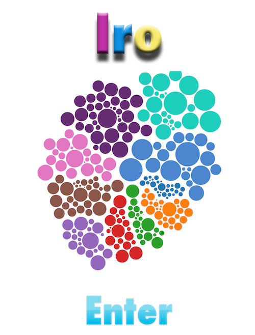
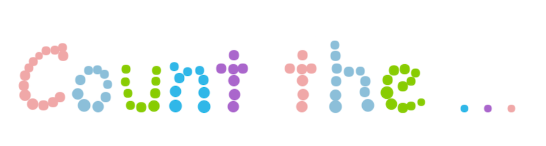
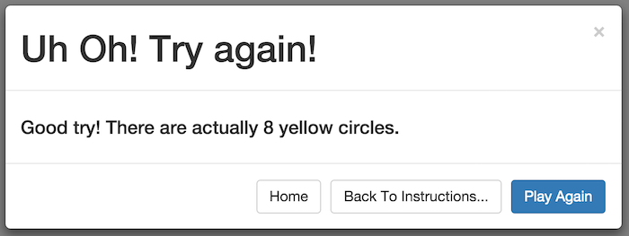

# Let's Play! - Iro

[hey people! i'm working on this today and will send out the PDF tonight. --Evan, Saturday 12/12]

CS177 Long Project

### [Link to Live Game](http://hills.ccsf.edu/~iandroni/cs177_Iro/cluster2/index.html)

Preview animation:

## Group Members & Roles

### Member List

| Name | CCSF username | Github username |
| ---- | ------------- | --------------- |
Ilmira Andronico | iandroni  | iandroni |
Christopher Black | cblack1 | ChrisBlack1989 |
Jasmine Farrell | jfarrel6 | jasmineiris |
Evan Morrison | emorris7 | evmo |
Tatyana Polyakova | tpolyako | tatyana12 |
Robert Mitchell | rmitchel | squeakyheatr |
David Wayman | dwayman | r3dcrosse |
|||
Zack Pierce |||
Ariel Salazar |||
Greg Stephens |||

### Functional Teams

- **Coding**: Jasmine Farrell, David Wayman, Chris Black, Robert Mitchell, Tatyana Polyakova
- **Specs & Documentation**: Ilmira Andronico, Evan Morrison, Robert Mitchell

### Individual Credits

(Each group member was responsible for writing their own list.)

#### Jasmine Farrell

- Iro Front page: Created all the images, cluster code and index.html in cluster file.
- Animated "Count the ... yellow circles" pages in Instruction folder: Fixed the animated page transition to 2 sec in lieu of the original 8 secs , changed RGB colors to match game colors, removed extra files, added source path to html file, updated content.
- Final Game page: created test.js and index.html in bubbles folder which contains the: animated circles, colors, bounce effect, fading effect, sound, and mouse click to remove bubbles.

#### David Wayman

- Essential for the game to be a game.
- Final game page: worked on test.js and index.html in bubbles folder; created score tracker, optional sound buttons, response to win or lose, replay features.
- Animated "Count the ... yellow circles" pages in Instruction folder: Updated content.

#### Robert Mitchell

- Modified bubbles file and changed name to bubbles2. 
- Animated "Count the ... yellow circles" pages in Instruction folder: created fade effect for the pages to transition. 
- Originally change content to instruct the child on how to play the game, later updated by Jasmine and David to reflect new content.
- Technical specification.

#### Tatyana Polyakova

- Creation the form "Tell your friend about IRO." This form would be helpful to let a lot of other people to know about IRO game.

#### Ilmira Andronico

- requirements
- function specs
- results of rounds of user testing

#### Evan Morrison

- writing and copy-editing
    - overview
    - requirements
    - user characteristics
    - game objectives
- git troubleshooting & assistance with more advanced git commands
- markdown formatting

(in progress)

## Functional Specification

### Overview

**Iro** is browser-based, interactive, educational game for children to learn how to distinguish colors and count objects within a time-limited period.

### Requirements

- Platform-independent: can be played in any modern web browser at [this link](http://hills.ccsf.edu/~iandroni/cs177_Iro/cluster2/index.html).
- Coded in Javascript, HTML, and CSS.
- Colorful splash/intro screen that provides entry (via clicking) to game instructions. 
- Colorful, dynamic game instructions, which transitions automatically after a few seconds to the game.
- Game screen with balls of different colors and sizes moving in random directions.
- Balls can be removed by clicking them.
- Balls begin fading from visibility after 5 seconds, completely disappearing after approximately 20 seconds.
- Background music (Jackson 5).
    + Buttons to switch music on or off.
- Text field and submit button to enter a guess.
- Pop-up box that provides feedback on guess (correct or incorrect).
    + Buttons offering links to play again, or return to game home or game instructions.

### User Characteristics

**Iro** is designed to be played by anyone who can:

- See.
- Read basic English.
- Count to 21.
- Use a web browser and basic input devices (mouse and keyboard).

### Game Objectives

On the main game screen, many circular objects (balls) of different sizes and colors are floating around in random directions. The objective is to count how many **yellow** balls are shown, and submit the answer via text input. There is an effective time limit of approximately 20 seconds, at which point the balls are no longer visible.

### Non-Goals

"Might-be-nice" game options that we are not implementing at this time:

- Change target color (the color that is counted).
- Change object shapes (circles only).
- Progression of difficulty levels.
- Concept of "score" across games (no credit for getting 2, 3, 4 correct answers in a row).
- Rewarding players for *speed* in choosing correct answer.
- Saving player results across sessions.

### Input
Primary input will come from user. After counting yellow balls user will have to enter the amount of circles.

### Output
This software will compare results from a user and a program and will give  the correct answer for a player.

### Screen by Screen Specification

“Iro” software will consist of home screen, 2 instructional pages, game mode and result screen

#### Home screen
After launching this software splash/intro screen will appear with ENTER button, which will lead  to instructional pages. This page is interactive, user will be able to play or move around the circles.

#### Instructions/rules
Users can see insructions of this game on 2 interactive pages. They will be able to interact with words written in dots by moving they kursor.  

#### Game screen
This screen will contain different colored circles, result field, where player can enter there count (enter the number or wright it out), and Go button.
User will have an option to pop circles (then circles will disappear) for easier count.

#### Result screen
User will get a message about result of this game and correct count. This screen will also contain "Home", "Back to instructions" or "Play again" buttons. "Home" button will take user to very first home screen, "Back to instructions" button - to instruction, "Play again" will start over the game.  

## Technical Specification

Software “Iro” will be developed using Java Script, CSS and HTML programming languages. It will consist of home screen, instructions, game mode and result screen.

- sources code academy for animation of bubbles in Introduction pages.
- bootstrap framework for results pop up screen, text input, sound buttons (using JQuery), -D3J for animation of the clusters.

All algorithms used are predefined, except the one that checks for spelled numbers, which was created by David Wayman.

### User Documentation

Splash screen - you can interact with circles or enter the game by pressing ENTER button

Instructions:
1.Count the...

2.Yellow circles...

Main game - now you need to count yellow circles before they fade out (5c), there is an option to pop up circles for better view or better count of yellow circles or just for fun. After getting count of circles, you need to enter the result into result fieled by entering the number or spelling the number with letters. Then push GO button to see result. Also there is background music which you can turn on/off by using button to the right of GO button.

Results:
1.Try again - that's what you see if you get your answer wrong

2.Correct - that's what you see if you get your answer right

You can exit tha game at any time by closing the browser (pressing X)

### Results of user testing

For user testing of our game we asked 3 children  to play the game and give us feedback.

Layden, 5 year old boy:
He does not know how to read yet, so he needed help from his parents to play. He liked colored circles and the ability to play with them (move them around and pop them). Also he liked counting them.

Kailyn, 7 year old girl:
She was able to play this game on her own. Liked playing it for first 15 min but then she got bored because it seem repetative, there were no other colors or shapes to count.

Kendal, 11 year old girl:
She thought this game was too easy to play and needed to be more complex. She would have liked more rounds, different choice of colored circles or shapes to count.

We also got feedback from adult users.

This is our first release of the game. After getting user feedback we were unable to make any changes before our release date due to lack of programming knowledge and limited time constraints. In our next release we could take in consideration all suggestions: add different shapes and ask the user to count shapes in different colors. We can let users choose colors they want to work with and add circles and fading time to higher levels. From our feedback we could also change game music with each level played.
We realized that this version of the game could only be marketed for children ages 4 -7.
