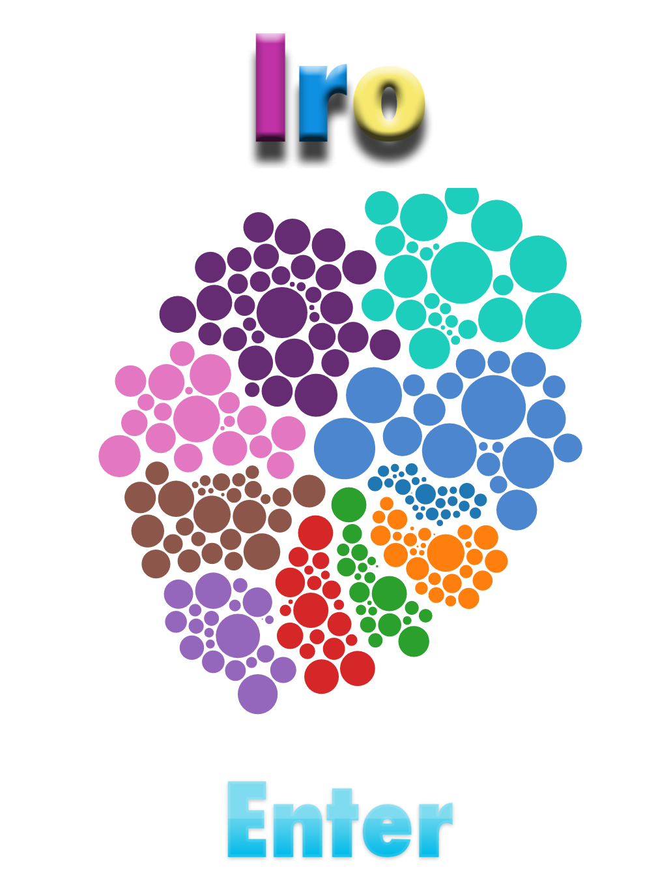
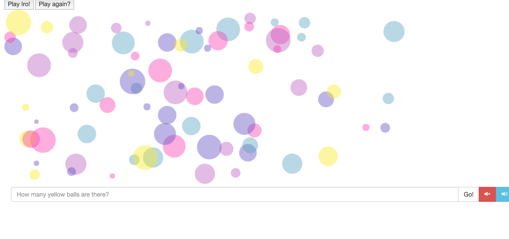
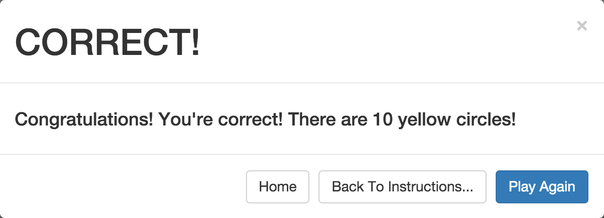

# Let's Play! - Iro

CS177 Long Project

## Group Members

| Name | CCSF username | Github username |
| ---- | ------------- | --------------- |
Ilmira Andronico | iandroni  | iandroni |
Christopher Black | cblack1 |  |
Jasmine Farrell | jfarrel6 | jasmineiris |
Evan Morrison | emorris7 | evmo |
Zack Pierce | ppierce2 | zackerypierce |
Tatyana Polyakova | tpolyako | tatyana12 |
Robert Mitchell | rmitchel | squeakyheatr |
Ariel Salazar |  | itozann |
Greg Stephens |  |  |
David Wayman | dwayman | r3dcrosse |

### Location of our game is: http://hills.ccsf.edu/~iandroni/cs177_Iro/index.html

### Roles

<<<<<<< HEAD
- Coding: Jasmine Farrell, David Wayman, Robert Mitchell, Tatyana Polyakova
- Documentation: Ilmira Andronico, Evan Morrison
=======
- Coding:
- Jasmine Farrell(page1, page 2, page3)
- David Wayman(results pop up screen)
- Robert Mitchell(page2, page 3 - bubble animation )
- Documentation: 
- Ilmira Andronico (requirements, function specs) 
- Evan Morrison (user documentation)
>>>>>>> db389a3e924e94f93df25abcaddaa86ccffd8529
- QA testing: Ilmira Andronico
- 
sources code academy
bootstarp framework for results pop up screen, text input, sound buttons (using JQuery), D3J for animation of the clusters,

licence to anumated bubbles in intruction folder

## Overview

**Let’s Play! - Iro** is browser-based, interactive, educational game in which the player sorts colors and counts yellow color balls within set amount of time.

## Requirements

- Coded in Javascript, HTML, and CSS.
- Game is platform-independent and can be played in any modern web browser.
- Splash/intro screen, which leads to the 3 instructional pages of the game, which leads to game mode and result pop-up screen
- Splash/intro screen and instructional pages must be interactive to keep interest for users 
- Game must have background music with on/off option.
- After this game is completed users asked to provide a short info about themself and write some comments about this game.
- If users like this game they could send a special form provided to let their firends to know about this game.
 

## Functional Specification

### Possible Scenario
To be able to play this game user will have to go to http://hills.ccsf.edu/~iandroni/cs177_Iro/index.html.  After lunching this file, user will see intro page with ENTER button located on the buttom of that screen. By pressing ENTER button, player will move to pages with instructions  of the game, then different colored circles will apear on the screen. After pressing P circles will start fading (5 sec) and player would have to count the the yellow colored circles and enter the result in the field below. By pushing GO user can get the correct result with options to "go back to instructions" or "play again". Player can exit the game at any stage by pushing X (closing browser).

### Non Goals
"Let's play! -Iro  will not provide an option to select different color or different object. Player wil not be able to keep the score of the game. 

#### Input
Primary input will come from user. After counting yellow balls user will have to enter the amount of circles. 

#### Output
This software will compare results from a user and a program and will give  the correct answer for a player.

### Screen by screen specification

“Let’s play! Iro” software will consist of home screen, 3 instructional pages, game mode and result screen

#### Home screen
After launching this software splash/intro screen will appear with ENTER button, which will lead  to instructional pages.

#### Instructions/rules
Users can see insructions of this game on 3 interactive pages. They will be able to interact with words written in dots by moving they kursor.  

#### Game screen
This screen will contain of different colored circles, Result Field where player can enter there count and Go button.

#### Result screen
User will get a message about result of this game and correct count. This screen will also contain "Go back to instructions" or "Play again" button

### Technical Specification

Software “Let’s play! -Iro” will be developed using Java Script, CSS and HTML programming languages. It will consist of home screen, game mode and result screen.
Home screen should have the name of the game, colored circled objects and  “Next” button that should take player to instructional pages.

The screen will  include 10 different colors on color list for user to choose and  a timer . After player has chosen color, timer will start and Screen with different colors and objects will appear. First level of the game should have min  of 2 - max  of 4 different colors, including selected by user color and min of 3 - max 6 different objects. Timer will be set at 10 sec. Each level will add 2 different colors and 2 different objects and 5 sec on the clock.

After timer runs out player will be moved to result screen where she/he can enter hers/his result in field “Enter number of objects in your color”. By clicking “Check” button results will be compared and message “You are correct! Good job!” or “Sorry, try again!” will appear. Button “Play again” can take a player to a game mode screen or “Exit” button will close this game. On the bottom of that screen user can see a list of the players and their scores.
Score will increase by 1 after correct result . When player gets 5 correct answers she/he will be moved to a higher level.

### User Documentation 

Screen 1

Screen 2

Screen 3

Screen 4

### Results of user testing

