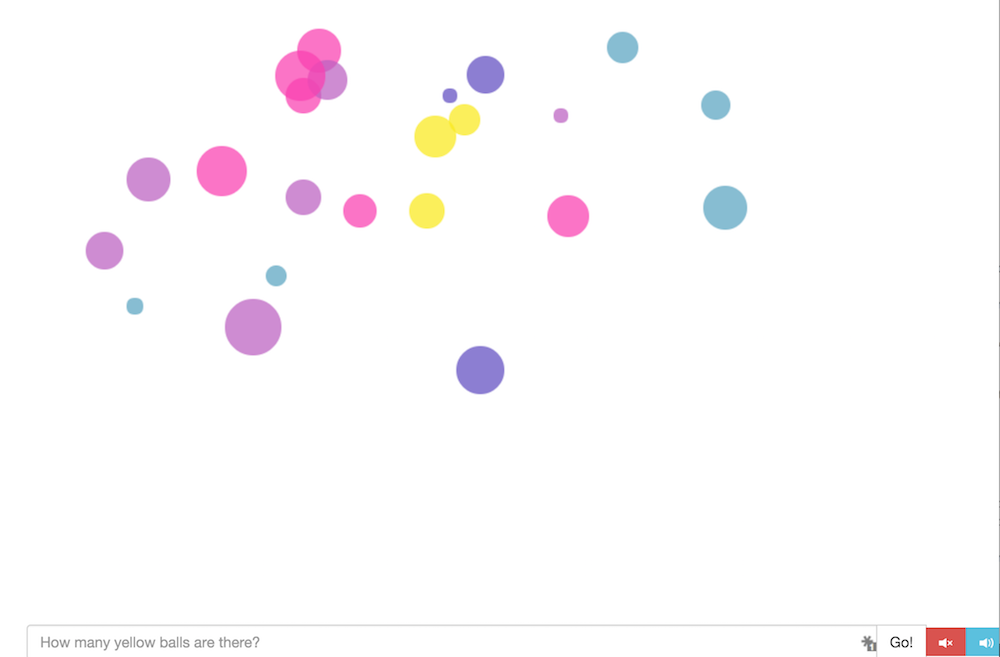

# Let's Play! - Iro

CS177 Long Project

## Group Members

| Name | CCSF username | Github username |
| ---- | ------------- | --------------- |
Ilmira Andronico | iandroni  | iandroni |
Christopher Black | cblack1 |  |
Jasmine Farrell | jfarrel6 | jasmineiris |
Evan Morrison | emorris7 | evmo |
Zack Pierce | ppierce2 | zackerypierce |
Tatyana Polyakova | tpolyako | tatyana12 |
Robert Mitchell | rmitchel | squeakyheatr |
Ariel Salazar |  | itozann |
Greg Stephens |  |  |
David Wayman | dwayman | r3dcrosse |

### Location of our game is: http://hills.ccsf.edu/~iandroni/cluster2/index.html

### Roles

- Coding: Jasmine Farrell, David Wayman, Robert Mitchell
- Documentation: Ilmira Andronico, Evan Morrison

=======
- Coding:

Jasmine Farrell: 
Iro Front page: Created all the images, cluster code and index.html in cluster file.
Animated "Count the ... yellow circles" pages in Instruction folder: Fixed the animated page transition to 2 sec in lieu of the original 8 secs , changed RGB colors to match game colors, removed extra files, added source path to html file, updated content.
Final Game page: created test.js and index.html in bubbles folder which contains the: animated circles, colors, bounce effect, fading effect, sound, and mouse click to remove bubbles.

David Wayman: 
Essential for the game to be a game. 
Final game page: worked on test.js and index.html in bubbles folder; created score tracker, optional sound buttons, response to win or lose, replay features. 
Animated "Count the ... yellow circles" pages in Instruction folder: Updated content.

Robert Mitchell: 
Animated "Count the ... yellow circles" pages in Instruction folder: created fade effect for the pages to transition. Originally change content to instruct the child on how to play the game, later updated by Jasmine and David to reflect new content.

- Documentation: 
- Ilmira Andronico (requirements, function specs, results of rounds of user testing) 
- Evan Morrison (user documentation)
- QA testing: Ilmira Andronico

## Overview

**Iro** is browser-based, K-5, interactive, educational game to learn how to sorts colors and counts yellow color balls for a period of time.

## Requirements

- Coded in Javascript, HTML, and CSS.
- Game is platform-independent and can be played in any modern web browser.
- Splash/intro screen, which leads to the instructional pages of the game, which leads to game mode and result pop-up screen
- Splash/intro screen and instructional pages must be interactive and colorful to keep interest for users 
- Game must have background music with on/off option.

 ## Functional Specification

### Possible Scenario
To be able to play this game user will have to go to http://hills.ccsf.edu/~iandroni/cluster2/index.html.  After lunching this file, user will see intro page with ENTER button located on the buttom of that screen. By pressing ENTER button, player will move to pages with instructions  of the game, then different colored circles will apear on the screen. Circles will start fading (5 sec) and player would have to count the the yellow colored circles and enter the result in the field below (they would be able to enter number or word for result). By pushing GO user can get the correct result with options to go "Home", "Back to instructions" or "Play again". Player can exit the game at any stage by pressing X (closing browser).

### Non Goals
"Let's play! -Iro  will not provide an option to select different color or different object. Player wil not be able to keep the score of the game. 

#### Input
Primary input will come from user. After counting yellow balls user will have to enter the amount of circles. 

#### Output
This software will compare results from a user and a program and will give  the correct answer for a player.

### Screen by screen specification

“Let’s play! Iro” software will consist of home screen, 2 instructional pages, game mode and result screen

#### Home screen
After launching this software splash/intro screen will appear with ENTER button, which will lead  to instructional pages. This page is interactive, user will be able to play or move around the circles.

#### Instructions/rules
Users can see insructions of this game on 2 interactive pages. They will be able to interact with words written in dots by moving they kursor.  

#### Game screen
This screen will contain different colored circles, result field, where player can enter there count, and Go button.
User will have an option to pop circles (then circles will disappear) for easier count. 

#### Result screen
User will get a message about result of this game and correct count. This screen will also contain "Home", "Back to instructions" or "Play again" buttons. "Home" button will take user to very first home screen, "Back to instructions" button - to instruction, "Play again" will start over the game.  

### Technical Specification

Software “Iro” will be developed using Java Script, CSS and HTML programming languages. It will consist of home screen, instructions, game mode and result screen.

sources code academy
bootstarp framework for results pop up screen, text input, sound buttons (using JQuery), D3J for animation of the clusters,

licence to anumated bubbles in intruction folder

### User Documentation 

Splash screen - you can interact with circles or enter the game by pressing ENTER button

Instructions:
1.Count the...

2.Yellow circles...

Main game - now you need to count yellow circles before they fade out (5c), there is an option to pop up circles for better view or better count of yellow circles or just for fun. After getting count of circles, you need to enter the result into result fieled by entering the number or spelling the number with letters. Then push GO button to see result. Also there is background music which you can turn on/off by using button to the right of GO button.

Results: 
1.Try again - that's what you see if you get your answer wrong

2.Correct - that's what you see if you get your answer right

You can exit tha game at any time by closing the browser (pressing X)

### Results of user testing

